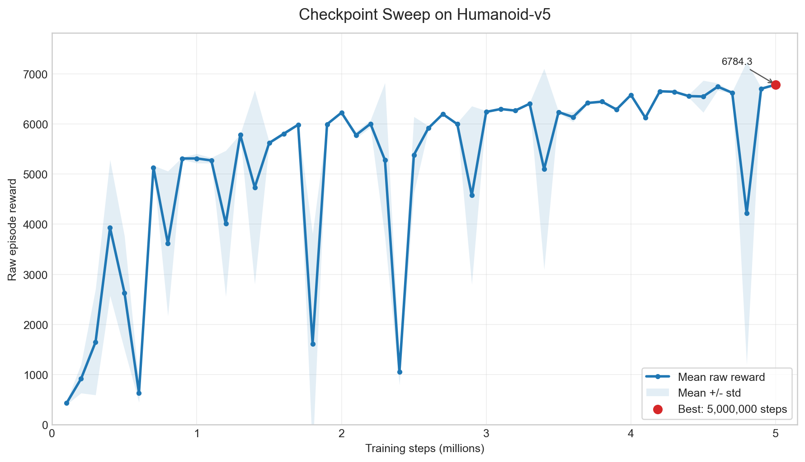

# 人工智能基础及应用大作业 3 报告

## 1. 任务背景

本次作业要求在 Gymnasium MuJoCo `Humanoid-v5` 环境中训练强化学习智能体，使三维人形机器人在保持平衡的同时尽可能向前移动。该任务属于高维连续控制问题：智能体需要根据身体姿态、速度、关节状态和外力等观测信息，输出连续动作来控制多个关节。

作业最终成绩以原生环境 `step()` 返回的原始累计奖励为准，因此训练过程可以使用不同算法、不同日志方式和 checkpoint 策略，但最终评估必须加载训练好的 policy，在 `Humanoid-v5` 原生环境中统计 raw reward。本项目未修改环境物理参数、奖励函数或 `step()` 返回值。

训练和提交过程中重点满足以下要求：

- 保存完整训练配置和依赖版本，保证实验可复现。
- 保存训练过程中的 checkpoint，便于中断续训、回溯和模型选择。
- 使用原生环境 raw reward 进行最终评估。
- 训练步数严格控制在 5,000,000 环境交互步以内。
- 提交训练好的 policy 文件，便于助教加载验证。
- 按补充通知提交训练过程分段视频、最终结果截图和说明。

## 2. 环境与依赖

最终实验环境如下：

```text
env_id: Humanoid-v5
gymnasium==1.2.3
mujoco==3.8.1
stable-baselines3==2.8.0
torch==2.7.1
numpy==2.2.6
```

依赖版本记录在 `requirements.txt` 中。最终模型在本地 Windows + Conda CPU 环境中训练完成：

```text
Python: 3.12
Platform: Windows 11
Device: CPU
training seed: 3407
run_id: local_sac_cpu_5m_seed3407
```

早期也尝试过 Colab 和 Kaggle。云端平台适合快速验证，但存在断连、运行时重置、GPU 限额、输出不易回看等问题。最终选择本地 CPU 完成完整 5,000,000 步训练，主要原因是本地训练不中断、便于录屏、便于保存所有 checkpoint。

## 3. 方法选择

本项目先后尝试了 PPO、RL Zoo 风格 PPO、SAC 和 TD3。最终采用 Soft Actor-Critic (SAC)。

SAC 是一种最大熵 off-policy actor-critic 算法，适合连续动作控制任务。它同时优化累计奖励和策略熵，既追求高奖励，也保留一定探索能力。与 PPO 相比，SAC 能复用经验回放池中的历史样本，在本任务中表现出更高的样本效率和更好的最终分数。

最终配置文件为：

```text
configs/sac_humanoid_cpu_probe.json
```

核心参数如下：

```text
algorithm: SAC
policy: MlpPolicy
learning_rate: 3e-4
buffer_size: 300000
learning_starts: 5000
batch_size: 256
gamma: 0.99
tau: 0.005
train_freq: 4
gradient_steps: 1
ent_coef: auto
policy_net_arch: [256, 256]
qf_net_arch: [256, 256]
normalize_observation: false
normalize_reward: false
```

最终 SAC 模型没有使用 VecNormalize，因此提交和测试时只需要 policy checkpoint，不需要额外加载归一化统计文件。

## 4. 可复现设置

为保证实验过程可复现，本项目固定了训练配置、依赖版本、训练步数和随机种子，并在每个 run 中保存配置与元数据。

主要设置如下：

- 固定环境为 `Humanoid-v5`。
- 固定训练随机种子为 `3407`。
- 固定最终训练上限为 `5,000,000` 环境交互步。
- 每隔固定步数保存 checkpoint，支持中断后继续训练。
- 评估阶段显式传入测试 seed，并通过 `env.reset(seed=...)` 控制评估初始状态。
- 使用 `evaluate_checkpoints.py`、`evaluate.py` 和 `test.py` 保存评估 CSV/JSON，便于复查。

需要说明的是，深度强化学习训练过程存在一定非确定性，例如神经网络初始化、经验回放采样和硬件平台差异都可能造成训练轨迹变化。因此最终以提交的 policy checkpoint 在原生环境中的 raw reward 评估结果为准。

## 5. 分段训练命令

训练脚本使用两种输出模式：

- 多输出模式：用于录屏展示。开启进度条和指标表，较高频输出 reward、episode length、fps 和训练损失。
- 安静输出模式：用于长时间训练。关闭进度条并低频输出，避免终端输出过多。

下面四段命令使用同一个 run 名称 `local_sac_cpu_5m_seed3407`，按顺序运行即可复现完整训练流程。

### 5.1 0 到 100,000 步：多输出模式

用于展示训练开始阶段。

```bat
python train_sac.py --config configs/sac_humanoid_cpu_probe.json --target-steps 100000 --device cpu --quiet --progress-bar --status-freq 1000 --metric-table --checkpoint-freq 50000 --eval-freq 50000 --run-name local_sac_cpu_5m_seed3407
```

### 5.2 100,000 到 2,900,000 步：安静输出模式

用于完成较长的中前期训练。

```bat
python train_sac.py --resume-from runs/local_sac_cpu_5m_seed3407 --resume-step 100000 --target-steps 2900000 --device cpu --quiet --no-progress-bar --status-freq 100000 --checkpoint-freq 100000 --eval-freq 100000
```

### 5.3 2,900,000 到 3,000,000 步：多输出模式

用于展示训练中期阶段。

```bat
python train_sac.py --resume-from runs/local_sac_cpu_5m_seed3407 --resume-step 2900000 --target-steps 3000000 --device cpu --quiet --progress-bar --status-freq 1000 --metric-table --checkpoint-freq 50000 --eval-freq 50000
```

### 5.4 3,000,000 到 5,000,000 步：安静输出模式

用于完成最终训练并保存最终 policy。

```bat
python train_sac.py --resume-from runs/local_sac_cpu_5m_seed3407 --resume-step 3000000 --target-steps 5000000 --device cpu --quiet --no-progress-bar --status-freq 100000 --checkpoint-freq 100000 --eval-freq 100000
```

## 6. 测试与模型选择流程

训练完成后没有直接只使用最后一个模型，而是先扫描多个 checkpoint 进行初筛，再对最佳 checkpoint 进行正式测试。

### 6.1 Checkpoint 初筛

使用 `evaluate_checkpoints.py` 扫描保存的 checkpoint。初筛阶段使用 seeds `0 1 2 3 4`，每个 seed 测试 1 个 episode，并按 mean reward 排序。

```bat
python evaluate_checkpoints.py --run-dir runs/local_sac_cpu_5m_seed3407 --every 100000 --seeds 0 1 2 3 4 --episodes-per-seed 1 --device cpu
```

完整 checkpoint sweep 数据保存于：

```text
docs/checkpoint_sweep_data.csv
```

图 1 展示了不同 checkpoint 的平均原始累计奖励变化。可以看到，模型在训练后期整体保持较高水平，其中 `5,000,000` 步 checkpoint 的平均奖励最高。



初筛结果前十名如下：

```text
step       mean_reward   std_reward   min_reward   max_reward   mean_length
5000000   6784.349      21.355       6757.746     6809.433     1000.000
4600000   6744.175      71.296       6612.640     6802.408     1000.000
4900000   6702.615      22.991       6666.579     6724.116     1000.000
4200000   6652.197      16.529       6636.470     6680.779     1000.000
4300000   6642.718      21.127       6613.723     6667.693     1000.000
4700000   6623.434      20.275       6600.345     6653.502     1000.000
4000000   6578.966      20.748       6554.179     6610.738     1000.000
4400000   6556.328      29.675       6502.132     6582.777     1000.000
4500000   6548.726      318.220      5913.468     6741.786     975.800
3800000   6445.598      26.974       6412.983     6494.181     1000.000
```

初筛结果显示 `5000000` 步 checkpoint 表现最好，因此选择它作为最终提交 policy。

### 6.2 正式 10-seed 测试

对初筛选出的 `5000000` 步 checkpoint 进行正式 10-seed 原始累计奖励评估：

```bat
python evaluate.py --run-dir runs/local_sac_cpu_5m_seed3407 --checkpoint-step 5000000 --seeds 0 1 2 3 4 5 6 7 8 9 --episodes-per-seed 1 --device cpu
```

结果如下：

```text
episodes: 10
mean_reward: 6780.676
std_reward: 24.244
min_reward: 6753.711
max_reward: 6817.721
mean_length: 1000.0
```

各 seed 奖励如下：

```text
[6809.433, 6802.217, 6791.833, 6757.746, 6760.515,
 6754.391, 6760.397, 6798.800, 6817.721, 6753.711]
```

### 6.3 固定 seed 单次测试

另外使用固定 `seed=123` 进行单次测试，便于视频和截图展示：

```bat
python test.py --run-dir runs/local_sac_cpu_5m_seed3407 --checkpoint-step 5000000 --seed 123 --episodes 1 --device cpu
```

结果如下：

```text
raw_reward: 6780.809
length: 1000
terminated: False
truncated: True
```

`length=1000` 且 `truncated=True` 表示策略能够稳定运行到环境默认最大 episode 长度，而不是提前摔倒终止。

## 7. 视频生成与录屏说明

根据作业补充通知，训练过程视频采用分段录制方式：训练开始片段、中期片段、尾声截图和最终测试结果。分段训练命令见第 5 节。

最终 policy 的行走视频可以用两种方式生成。

### 7.1 直接录制 policy 视频

在本地 Windows 环境中可使用 `glfw` 后端：

```bat
python record_video.py --run-dir runs/local_sac_cpu_5m_seed3407 --checkpoint-step 5000000 --seed 123 --episodes 1 --device cpu --backend glfw --fps 20
```

视频保存目录：

```text
runs/local_sac_cpu_5m_seed3407/videos/
```

### 7.2 先导出轨迹再渲染

如果直接渲染遇到 MuJoCo/OpenGL 后端问题，可以先导出动作轨迹，再单独渲染：

```bat
python export_trajectory.py --run-dir runs/local_sac_cpu_5m_seed3407 --checkpoint-step 5000000 --seed 123 --episodes 1 --device cpu
```

```bat
python render_latest_trajectory.py --run-dir runs/local_sac_cpu_5m_seed3407 --backend glfw --fps 20 --repeat 3
```

这种方式将 policy 执行和 MuJoCo 渲染拆开，稳定性更好。渲染结果保存在：

```text
runs/local_sac_cpu_5m_seed3407/trajectories/videos/
```

## 8. 实验结果与分析

从实验结果看，SAC 明显优于本项目尝试过的 PPO 和 TD3 分支。PPO 可以跑通完整流程，但在 Humanoid-v5 上分数较低。RL Zoo 风格 PPO 的 5,000,000 步候选模型正式 10-seed 平均奖励约为 `2179.016`，仍明显低于最终 SAC 模型。TD3 早期探针在本地 CPU 上训练速度和效果均不如 SAC，因此未作为最终方向。

SAC 的早期训练波动较大，但随着训练继续，策略逐渐学会稳定步态。训练中也观察到 checkpoint 表现并非严格随步数单调提升，因此使用 checkpoint sweep 选择最终模型是必要的。本次最终本地训练中，5,000,000 步 checkpoint 在初筛和正式测试中均表现最好。

最终模型在 10 个不同测试 seed 下均达到 `mean_length=1000.0`，说明策略不是只对单个 seed 有效，而是在不同初始条件下都能稳定走完整个 episode。最终 10-seed mean reward 为 `6780.676`，固定 seed=123 raw reward 为 `6780.809`。

## 9. 提交材料

建议提交以下内容：

- 完整源代码。
- `requirements.txt`。
- 本报告。
- 视频说明文档 `docs/video_explanation.md`。
- 最终 policy 文件：
  `runs/local_sac_cpu_5m_seed3407/models/checkpoint_model_5000000_steps.zip`
- checkpoint 初筛结果 CSV/JSON。
- 正式 10-seed 评估结果 CSV/JSON。
- 训练开始、中期、尾声截图或分段录屏。
- 最终 policy 行走视频。

## 10. 参考资料

- Gymnasium Humanoid-v5 documentation: https://gymnasium.farama.org/environments/mujoco/humanoid/
- Soft Actor-Critic: https://arxiv.org/abs/1801.01290
- Soft Actor-Critic Algorithms and Applications: https://arxiv.org/abs/1812.05905
- Proximal Policy Optimization Algorithms: https://arxiv.org/abs/1707.06347
- Twin Delayed DDPG: https://arxiv.org/abs/1802.09477
- Stable-Baselines3 documentation: https://stable-baselines3.readthedocs.io/
